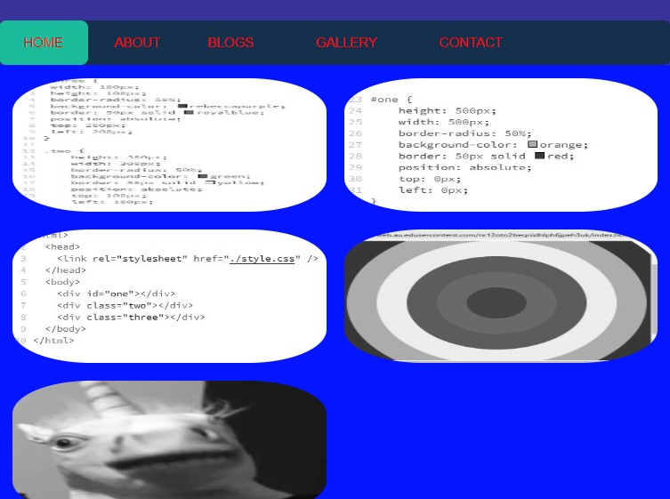

# Brandon Powell's Portfolio
My GitHub Repo:

https://github.com/Brandon-Powell25/Asignment_T1A2

My Live Website on Netlify:

https://brandonpowell.netlify.app/

My Portfolio PPT:

https://youtu.be/WBqvnreAwZs

## Overview

This is my portflio assignment to demostrate the skill and knowledge i have learnt from Coder academy.

## Purpose
The is the build a website, to show empolyer the skills i have learnt while studying at Coder Academy.

## Functionality / features

### Home Page

The Home Page contains the logo i created in Looka, Brandon Powell Web design. An image is below:

The navbar is underneath. It is lavalamp style menu as in the colour bar changes a different colour when hovered over the different website pages. The codepen for this is:
https://codepen.io/Patak/pen/QpLpOV

I have inluded an image of the codepen below:

Next we have a picture centered underneath the navbar. The picture is a screen with some coding. If you click on the image, it takes you to my Blogs page. Image is below:

Under that is text that says "Welcome to Brandon's Web Design Portfolio". This is displayed in 'Netflix' style writing. The codepen is below:

https://codepen.io/yemon/pen/BwOOWZ

The codepen image with code is below:

The footer is last. It is located at the bottom of the webpage. It has logos for Instagram, facebook, and Github and they link to their individual websites.

Here is the codepen:
https://codepen.io/dig-lopes/pen/WLVGda

Here is a photo of the footer:

Here is and image of the coding:

### About Page

The About page contains a photo of me on one side of the screen. The title 'About page' is on top of the other side and then contains a short bit about me. there is a Resume button at the bottom and when you click on it, it should come up and display in pdf format. The navbar and links are styled at the bottom of the article and picture. An image is below:

Thank to learningrobo for this code:
https://www.learningrobo.com/2021/09/responsive-about-us-page-using-html-css_01649346544.html

The image of the codepen and codes used are below:

### Blogs page

The Blogs Page retains the same header, navbar and footer from the home page. The About Page was the only one that looks different from the other pages on this website.

There is a small title that says "Welcome to my blogs" in capitals. My first article is titled 'Basic Coding html'. This title is located under the first article's image. Some placeholder text has been added underneath. If you click this first image, it will take you to an external website 'W3School Basic HTML'.

The next image is titled 'web development' and the layout is the same as the one previously. When you click on this image it takes you to an external website 'Wikipedia' with an entry on Web Development.

The next image is titled 'CSS Basics'. Same layout as before.When you click on this image it takes you to an external website 'W3School' with an entry on CSS Basics.

Next image is titled 'App Development'. Same layout. When you click the image it takes you to an external website ' Wikipadeia' with an entry on App Development.

The final image is titled 'Game Development'. Same deal. When you click the image it takes you to an external website 'wikipedia, with an entry on Game Development.

A picture of the Blog Page is below:

This is where i got the box showder content from:
https://cssgenerator.org/box-shadow-css-generator.html

### Gallery Page

The Gallery Page retains the same header, navbar and footer from the home page. The gallery contains five images displayed in rows. The first three images contain code to create the colourwheel seen in the fourth image. The last photo is just a silly one for giggles.

A photo of the gallery can be seen below:

### Contact page

The Contact page retains the same header, navbar and footer from the home page. The Contact page contains a form which contains a place for persons to place there name, email, subject matter and message.

A photo of the contact form is below:

The codepen link is:
https://codepen.io/wgnr/pen/ExKzNJ

Here is an image of the coding:

## Sitemap

The sitemap is a basic html sitemap which contains the basic flow or layout of the website. As you can see from the sitemap image below:

The sitemap has the website pages Home, About, Blogs, Gallery, Contact at the top of the sitemap as these are the main pages for our website. The Blogs page has five blog articles that are linked to the page.

## Screenshots
All different Veiw of my website eg (Laptop,Tablet,Mobile):
## Mobile View

## Tablet View

## Website Veiw

## Target Audience

## Tech Stack

 Looka.com - I used this to create my logo
 VS Code - used to compile code for my website
 Google chrome - search engine to help find inspiration adesign ideas for my, run Netlify etc,
 Figma - wireframe design drawings and displays layout of webpages
 Drawio - used to 
 Github - used to store our project and files linked to our website
 Netlify - used to send my website live
 HTML, CSS and SASS - used to create and style content on my website
 Codepen - a great source of ideas, different hover and animated effects etc and their codes used to make
Instagram, Facebook, Github - icons used in footer that link each of their own websites
W3School - great source of HTML and CSS content
Freefrontend.com - For some coding content
Snippet - usedto take image captures or screenshots
Discord - useful links and cheatsheets from our facilitaors and fellow students if they have had similar issues or problems, useful tips etc
Coder Academy Class Recordings - great source of info and was a big help when I got stuck with certain things
Facilitator George Zannos - Big help with setting up Github properly, helped create SSH key and everything Github related about this project. So big thanks to George.

